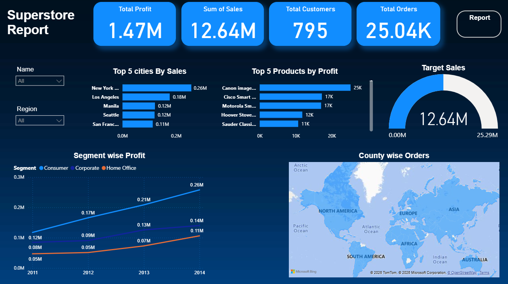

# 📊 Sales Data Analysis Dashboard

## 📌 Overview
This project analyzes the Global Superstore dataset to uncover key business insights and visualize performance using Power BI.

## 🔧 Tools Used
- SQL
- Excel
- Power BI

## 📌 Dataset
Global Superstore Dataset (pre-cleaned)

## 📊 Key Features
- Interactive dashboard with KPIs (Sales, Profit, Orders)
- Region-wise and category-wise analysis
- Customer segmentation insights
- Trend analysis over time

## 📈 Key Insights
- Top-performing regions contribute a major share of total revenue
- Technology category generates highest profit margins
- Seasonal trends indicate peak sales during specific months

## 📂 Project Structure
```
sales-data-analysis-dashboard/
├── data/
│   └── global_superstore.xlsx      # Dataset file
├── dashboard/
│   └── sales_dashboard.pbix        # Power BI dashboard
├── screenshots/
│   └── dashboard.png               # Dashboard preview image
└── README.md                       # Project documentation
```


## 🖼️ Dashboard Preview


## ▶️ How to Use
1. Download the `.pbix` file from the dashboard folder  
2. Open in Power BI Desktop  
3. Explore filters and visualizations to analyze business performance

## 🚀 Conclusion
This project demonstrates how data analysis and visualization can be used to extract meaningful insights and support data-driven decision-making.
